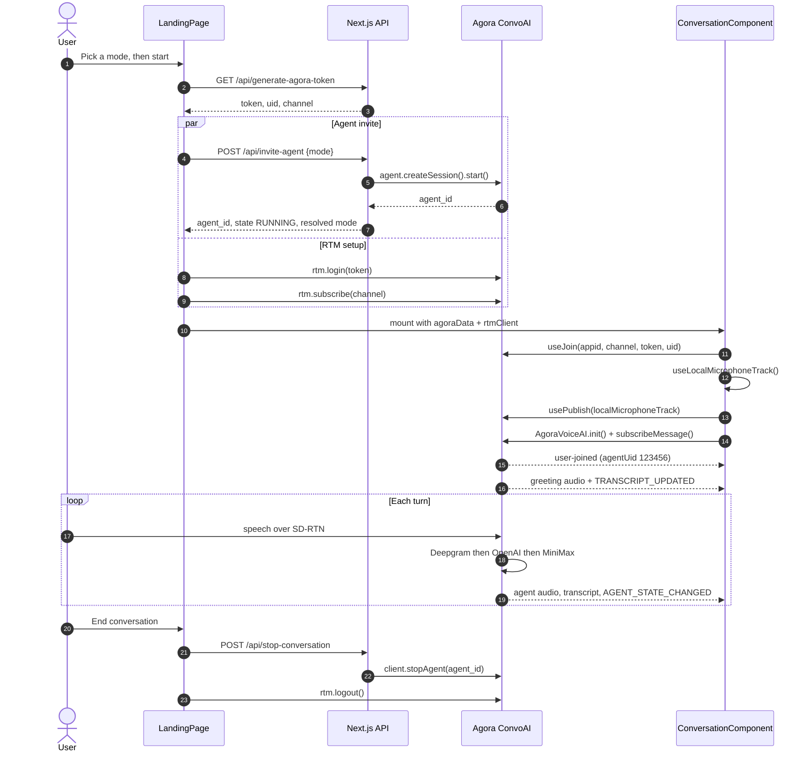
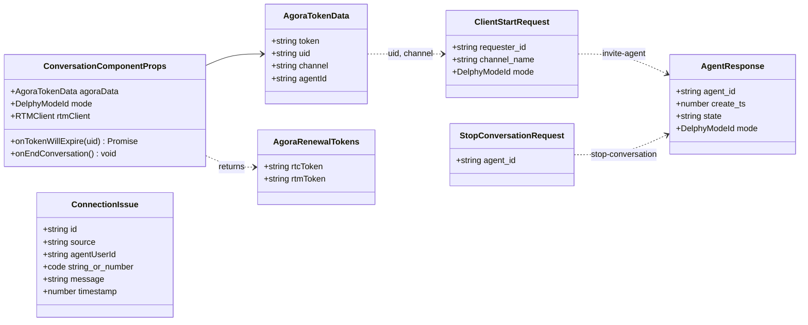
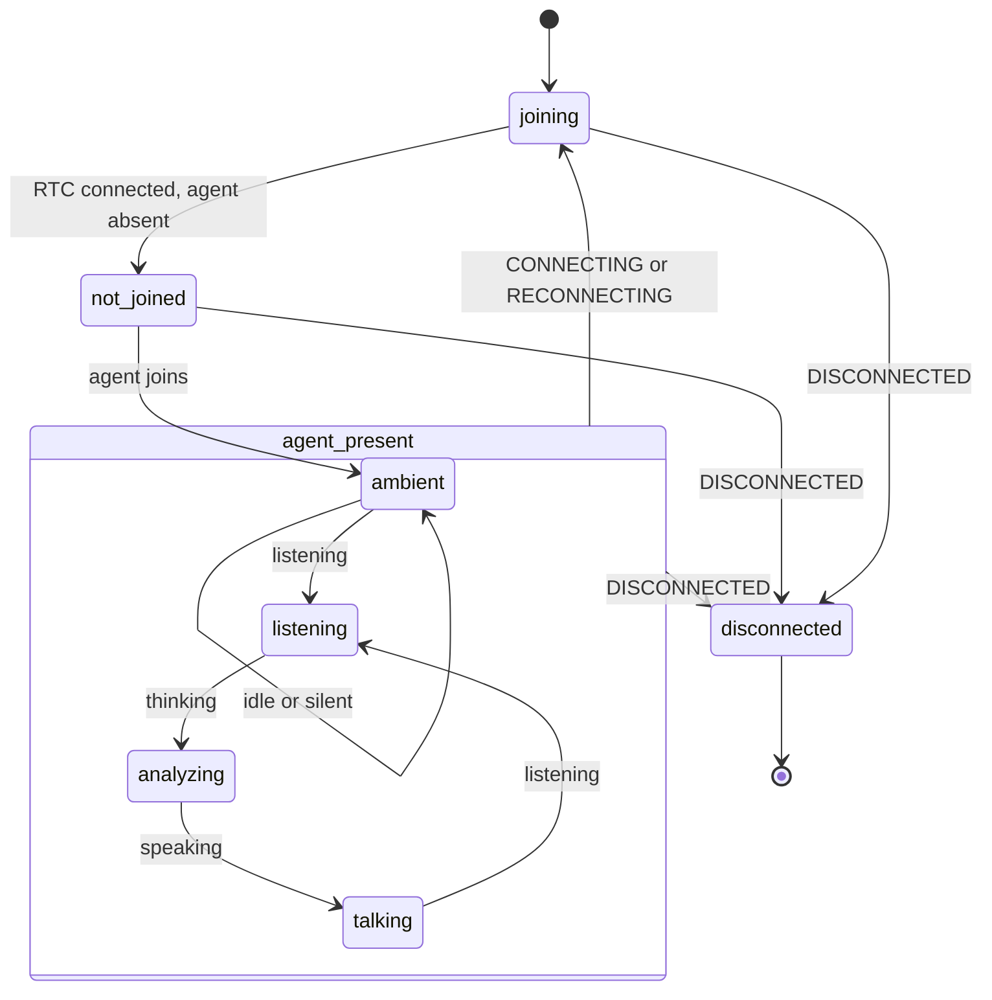
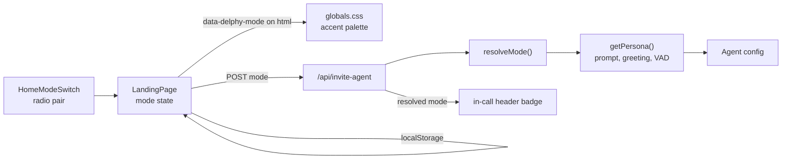
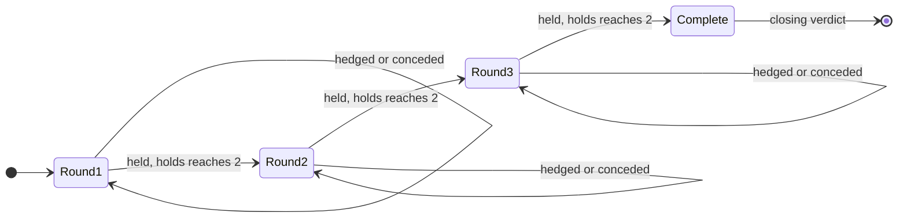

# Delphy

A voice-native sparring partner. Bring a position you actually hold, say it out
loud, and Delphy answers only in questions. It never states, never agrees, never
takes a side.

Two modes decide what the questions are *for*:

| Mode | Persona | What it goes after |
| --- | --- | --- |
| **Critical thinking** (default) | Socratic examiner | Why you believe it, why not the other thing, what you are assuming, what would change your mind |
| **Ragebait** | Devil's advocate | The weakest joint in the last thing you said, and it stays there |

The mode is picked before the call starts and fixed for its duration, because
the persona is baked into the agent at invite time.

Built on [Agora's Conversational AI Engine](https://docs.agora.io): a real-time
ASR → LLM → TTS pipeline running over Agora's SD-RTN, with transcripts and agent
state delivered to the browser over RTM.

---

## Stack

| Layer | Choice |
| --- | --- |
| Framework | Next.js 16 (App Router), React 19, TypeScript |
| Styling | Tailwind CSS 3, CSS custom-property design tokens |
| Realtime audio | `agora-rtc-sdk-ng` via `agora-rtc-react` |
| Signaling | `agora-rtm` (transcripts, agent state, metrics, errors) |
| Agent orchestration | `agora-agents` (server), `agora-agent-client-toolkit` (browser) |
| Call UI primitives | `agora-agent-uikit` |
| Speech-to-text | Deepgram `nova-3` |
| LLM | OpenAI `gpt-4o-mini` |
| Text-to-speech | MiniMax `speech_2_6_turbo` |

STT/LLM/TTS run through Agora's reseller presets, so no vendor API keys are
needed for the default pipeline. Each has a commented BYOK block in
`app/api/invite-agent/route.ts` if you would rather bring your own.

---

## System architecture


---

## Session lifecycle

The startup handshake is where most integration bugs live. Two things worth
noting: the agent invite and the RTM setup run **in parallel** — both only need
the token response — and the agent joins the channel asynchronously, so
`start()` returning does not mean the agent is already in the room.



**StrictMode note.** `ConversationComponent` gates both `useJoin` and
`useLocalMicrophoneTrack` behind an `isReady` flag set via `setTimeout(fn, 0)`.
React StrictMode fires cleanup synchronously before any timeout callback, so the
first (discarded) mount's timer is always cancelled and only the real mount
joins. Without this the app joins twice and creates two mic tracks, producing a
roughly 3-second audio gap.

---

## Types



`ConnectionIssue.source` is one of `rtm`, `agent`, or `rtm-signaling`, recording
which layer reported the problem. The in-call status panel de-duplicates issues
sharing an agent, code, and message within 1.5 seconds.

---

## Visualizer state

`mapAgentVisualizerState` in `lib/conversation.ts` folds three independent
signals — RTC connection state, agent presence, and agent state — into one
display state. Transport problems deliberately outrank agent state, so the
visualizer never claims to be "listening" in the middle of a reconnect.



---

## Modes

`lib/delphy/modes.ts` is the shared half: ids, the default, and every piece of
copy the homepage swaps when you change the selector. It is imported by the
browser, so it holds no prompts.

`lib/delphy/personas.ts` is the server half: the system prompt, the greeting,
the sampling temperature, and the turn-detection timings for each mode. Nothing
in the client bundle imports it.



An unknown or absent `mode` resolves to the default rather than 400-ing, so an
older client still gets a session. The route echoes the mode it actually used,
and the client labels the call from that echo rather than from its own request.

The two personas differ in more than wording. Critical thinking runs a lower
temperature, because its questions follow a sequence and wandering hurts, and
every turn-detection timing is more patient: working out a reason out loud
produces pauses that ragebait's timings would talk straight over.

---

## The call view

```
+--------------------------------------------------------------+
| Delphy  [Critical thinking]        3:41   * [End Conversation]|
| Pipeline  Deepgram STT / OpenAI LLM / MiniMax TTS             |
+---------------------------+----------------------------------+
| Transcript      [copy][dl]|                                   |
|                           |          AgentVisualizer          |
|  DELPHY 14:02             |                                   |
|  Why do you think that?   |   "Waiting for Delphy to join"    |
|                           |                                   |
|              YOU 14:02    |   ( mic ) [in] [out] [volume]     |
|   Because output went up  |        Press M to mute            |
+---------------------------+----------------------------------+
```

Things worth knowing about it:

- The header names the persona that actually started, taken from the invite
  response rather than from the request.
- `SessionTimer` owns its own state so the one-second tick re-renders one span
  instead of the visualizer, the transcript and the dock.
- The transcript exports as plain text. Ending the call is the only exit and it
  discards every turn, which is a poor outcome for an app whose entire output is
  what you said under questioning.
- `M` toggles the microphone unless focus is in an input or a modifier is held.
  A muted microphone gets a banner, not just a colour change on the button.
- The agent joins asynchronously, so the view distinguishes a normal wait from a
  failed one with a twelve second grace period rather than sitting in
  `not-joined` indefinitely.

---

## Not yet wired

`roundState.ts`, `prompts.ts`, `sessionStore.ts`, and `guardRail.ts` hold the
round-progression design — pure functions with **no importers outside that
folder**. The live agent runs from the mode persona described above and does not
score turns, so the rail on the homepage is static copy.

The same applies to `app/api/chat/completions/` — a working OpenAI-compatible
custom-LLM endpoint that the agent config does not point at, because `withLlm`
uses Agora's reseller preset instead.

The diagrams below describe that design, not what runs today.



At two strikes the round does not advance. `applyVerdict` instead returns
`escalated: true` plus a `pressure` steer — `vague` for a hedge, `escalate`
after two strikes — intended for the next question-generation call.

`guardRail.ts` enforces the one hard rule, that every Delphy line is a question.
It rejects text that does not end in a question mark, that opens with an
assertion, or that contains any declarative sentence of three or more words. The
intended flow is one stricter retry, then a canned in-character fallback.

---

## Project layout

```
app/
  layout.tsx                    root layout, metadata, social cards
  globals.css                   design tokens, mode accents, component styles
  opengraph-image.tsx           social card, generated at build from MODE_LIST
  api/
    generate-agora-token/       RTC+RTM token minting
    invite-agent/               per-mode agent config and session start
    stop-conversation/          idempotent agent teardown
    chat/completions/           custom-LLM endpoint (not wired)
components/
  LandingPage.tsx               session bootstrap, mode state, view switch
  HomePage.tsx                  pre-call homepage composition
  home/
    HomeNav.tsx                 sticky nav with a compact mode switch
    HomeHero.tsx                mode-aware headline, selector, CTA
    HomeModeSwitch.tsx          the two mode cards
    HomeHowItWorks.tsx          three steps, per mode
    HomeStarters.tsx            openers, so nobody freezes at the microphone
    HomeAnatomy.tsx             SVG of what each mode does to a claim
    HomeSampleExchange.tsx      illustrative transcript, per mode
    HomeRounds.tsx              the rail, per mode
    HomeFooter.tsx              attribution
  ConversationComponent.tsx     in-call join, publish, transcripts, teardown
  QuickstartConversationLayout  in-call shell: header, rail, stage, dock
  QuickstartTranscriptPanel     live turns, copy and download
  SessionTimer.tsx              elapsed time, self-contained tick
  LoadingSkeleton.tsx           stands in for the call view while it loads
  ConnectionStatusPanel.tsx     connection state and captured issues
  MicrophoneSelector.tsx        input-device switching
lib/
  agora.ts                      DEFAULT_AGENT_UID
  conversation.ts               transcript normalisation, state mapping
  conversation.test.ts          spacing, timestamps, visualizer precedence
  delphy/modes.ts               mode ids and homepage copy (client-safe)
  delphy/personas.ts            per-mode prompt, greeting, VAD tuning (server)
  delphy/*.test.ts              guardrail, round machine, mode invariants
  delphy/                       round logic and guardrail (not wired)
types/
  conversation.ts               shared API and prop types
```

---

## Running locally

Requires Node 22 or newer (`.nvmrc` pins 24) and pnpm.

```bash
pnpm install
pnpm dev
```

Create `.env` with your Agora credentials:

```
NEXT_PUBLIC_AGORA_APP_ID=your-app-id
NEXT_AGORA_APP_CERTIFICATE=your-app-certificate
```

Both come from the [Agora Console](https://console.agora.io). The certificate is
server-only — only `NEXT_PUBLIC_AGORA_APP_ID` reaches the browser.

### Checks

```bash
pnpm typecheck    # tsc --noEmit
pnpm lint         # eslint
pnpm test         # node:test over lib/**/*.test.ts
pnpm build        # next build
pnpm verify       # doctor, lint, typecheck, test, api contracts, build
```

`pnpm test` covers the pure logic: the guardrail's rejection of statements
wearing a question mark, the round machine's thresholds and immutability, the
mode copy invariants the UI depends on, and the visualizer precedence rule that
keeps "listening" off screen during a reconnect. It needs no `.env`, unlike
`pnpm verify`, which runs `doctor` first.

If those abort before running with `ERR_PNPM_IGNORED_BUILDS`, run
`pnpm approve-builds` once to let `esbuild`, `sharp`, and `unrs-resolver` run
their install scripts.

---

## Deploying

`vercel.json` and a multi-stage `Dockerfile` are both included. Set the same two
environment variables on whichever platform you use. The app needs no database —
`lib/delphy/sessionStore.ts` is an in-process `Map`, so it does not survive a
restart or scale past a single instance.
