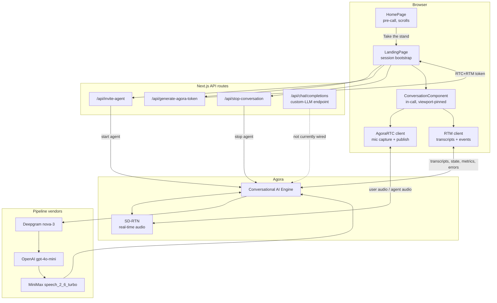
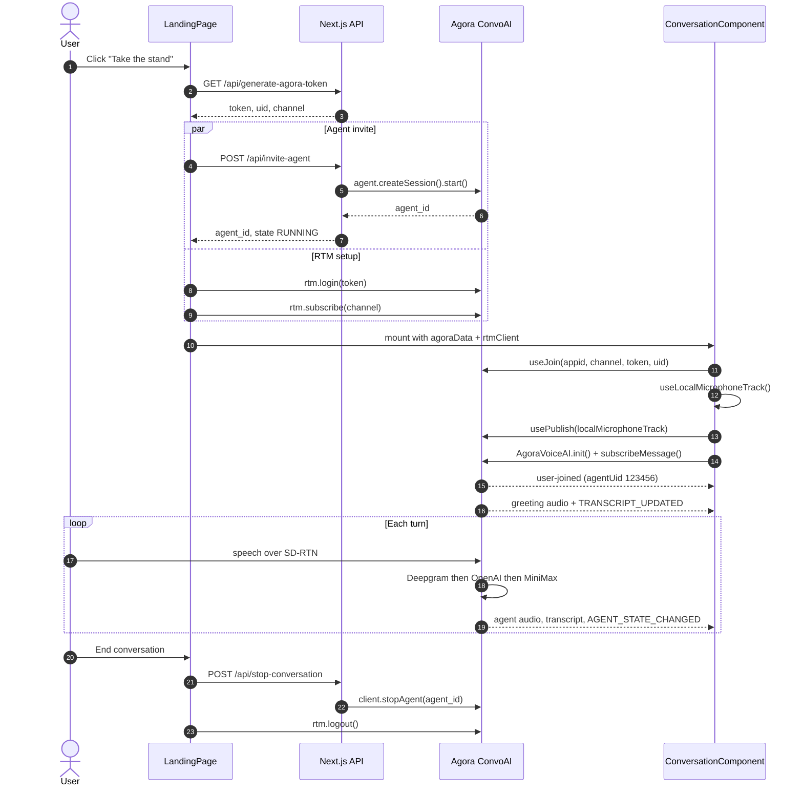
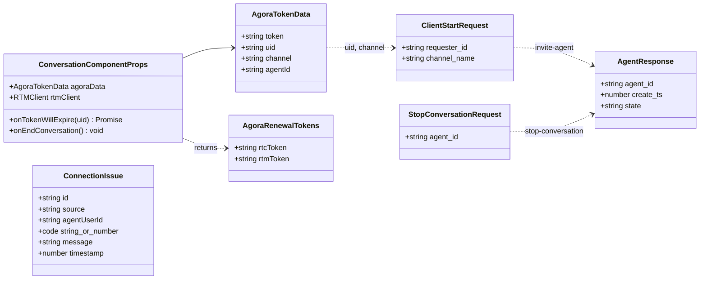
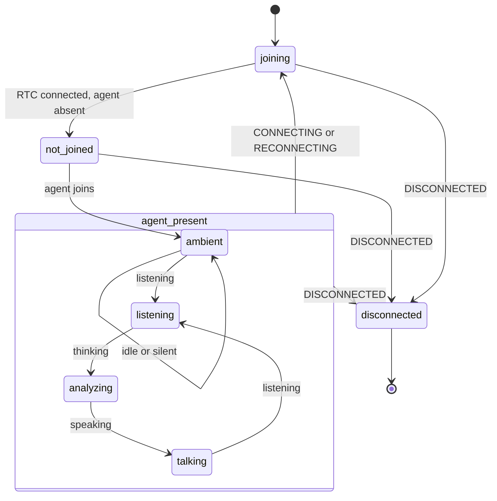
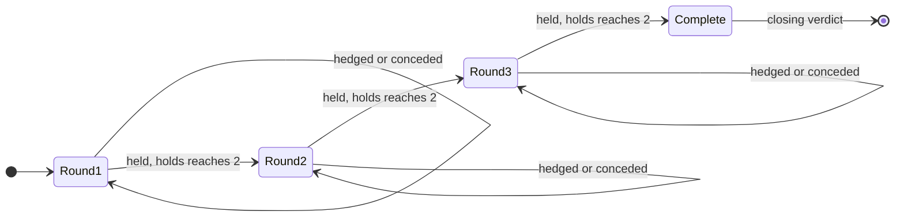

# Delphy

A voice-native devil's advocate. Bring a position you actually hold, say it out
loud, and Delphy answers only in questions — going straight for the weakest
thing you just said. It never states, never agrees, never takes a side.

Built on [Agora's Conversational AI Engine](https://docs.agora.io): a real-time
ASR → LLM → TTS pipeline running over Agora's SD-RTN, with transcripts and agent
state delivered to the browser over RTM.

---

## Stack

| Layer | Choice |
| --- | --- |
| Framework | Next.js 16 (App Router), React 19, TypeScript |
| Styling | Tailwind CSS 3, CSS custom-property design tokens |
| Realtime audio | `agora-rtc-sdk-ng` via `agora-rtc-react` |
| Signaling | `agora-rtm` (transcripts, agent state, metrics, errors) |
| Agent orchestration | `agora-agents` (server), `agora-agent-client-toolkit` (browser) |
| Call UI primitives | `agora-agent-uikit` |
| Speech-to-text | Deepgram `nova-3` |
| LLM | OpenAI `gpt-4o-mini` |
| Text-to-speech | MiniMax `speech_2_6_turbo` |

STT/LLM/TTS run through Agora's reseller presets, so no vendor API keys are
needed for the default pipeline. Each has a commented BYOK block in
`app/api/invite-agent/route.ts` if you would rather bring your own.

---

## System architecture



---

## Session lifecycle

The startup handshake is where most integration bugs live. Two things worth
noting: the agent invite and the RTM setup run **in parallel** — both only need
the token response — and the agent joins the channel asynchronously, so
`start()` returning does not mean the agent is already in the room.



**StrictMode note.** `ConversationComponent` gates both `useJoin` and
`useLocalMicrophoneTrack` behind an `isReady` flag set via `setTimeout(fn, 0)`.
React StrictMode fires cleanup synchronously before any timeout callback, so the
first (discarded) mount's timer is always cancelled and only the real mount
joins. Without this the app joins twice and creates two mic tracks, producing a
roughly 3-second audio gap.

---

## Types



`ConnectionIssue.source` is one of `rtm`, `agent`, or `rtm-signaling`, recording
which layer reported the problem. The in-call status panel de-duplicates issues
sharing an agent, code, and message within 1.5 seconds.

---

## Visualizer state

`mapAgentVisualizerState` in `lib/conversation.ts` folds three independent
signals — RTC connection state, agent presence, and agent state — into one
display state. Transport problems deliberately outrank agent state, so the
visualizer never claims to be "listening" in the middle of a reconnect.



---

## Not yet wired

`lib/delphy/` holds the round-progression design — pure functions with **no
importers outside that folder**. The live agent currently runs from the single
`DELPHY_PROMPT` system prompt in `app/api/invite-agent/route.ts`, and the
`01 / 02 / 03` rail on the homepage is static.

The same applies to `app/api/chat/completions/` — a working OpenAI-compatible
custom-LLM endpoint that the agent config does not point at, because `withLlm`
uses Agora's reseller preset instead.

The diagrams below describe that design, not what runs today.



At two strikes the round does not advance. `applyVerdict` instead returns
`escalated: true` plus a `pressure` steer — `vague` for a hedge, `escalate`
after two strikes — intended for the next question-generation call.

`guardRail.ts` enforces the one hard rule, that every Delphy line is a question.
It rejects text that does not end in a question mark, that opens with an
assertion, or that contains any declarative sentence of three or more words. The
intended flow is one stricter retry, then a canned in-character fallback.

---

## Project layout

```
app/
  layout.tsx                    root layout and metadata
  globals.css                   design tokens and Delphy light palette
  api/
    generate-agora-token/       RTC+RTM token minting
    invite-agent/               agent config and session start
    stop-conversation/          idempotent agent teardown
    chat/completions/           custom-LLM endpoint (not wired)
components/
  LandingPage.tsx               session bootstrap, view switch
  HomePage.tsx                  pre-call homepage composition
  home/                         nav, hero, how-it-works, sample, rounds, footer
  ConversationComponent.tsx     in-call join, publish, transcripts, teardown
  ConnectionStatusPanel.tsx     connection state and captured issues
  MicrophoneSelector.tsx        input-device switching
lib/
  agora.ts                      DEFAULT_AGENT_UID
  conversation.ts               transcript normalisation, state mapping
  delphy/                       round logic and guardrail (not wired)
types/
  conversation.ts               shared API and prop types
```

---

## Running locally

Requires Node 22 or newer (`.nvmrc` pins 24) and pnpm.

```bash
pnpm install
pnpm dev
```

Create `.env` with your Agora credentials:

```
NEXT_PUBLIC_AGORA_APP_ID=your-app-id
NEXT_AGORA_APP_CERTIFICATE=your-app-certificate
```

Both come from the [Agora Console](https://console.agora.io). The certificate is
server-only — only `NEXT_PUBLIC_AGORA_APP_ID` reaches the browser.

### Checks

```bash
pnpm typecheck    # tsc --noEmit
pnpm lint         # eslint
pnpm build        # next build
pnpm verify       # doctor, lint, typecheck, api contracts, build
```

If those abort before running with `ERR_PNPM_IGNORED_BUILDS`, run
`pnpm approve-builds` once to let `esbuild`, `sharp`, and `unrs-resolver` run
their install scripts.

---

## Deploying

`vercel.json` and a multi-stage `Dockerfile` are both included. Set the same two
environment variables on whichever platform you use. The app needs no database —
`lib/delphy/sessionStore.ts` is an in-process `Map`, so it does not survive a
restart or scale past a single instance.
